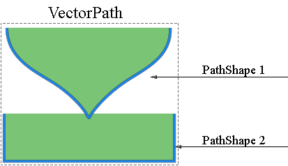

### **Layer Vector Mask Overview**
A vector mask is a resolution-independent path that clips out the contents of the layer. Vector masks are usually more accurate than those created with pixel-based tools. You create vector masks with the pen or shapes tools.

Aspose.PSD supports rendering and applying of vector masks. You can edit vector masks through editing of Vector Paths.
### **Vector path in Aspose.PSD**
Access to vector paths in Aspose.PSD is provided through [VsmsResouce](https://apireference.aspose.com/psd/net/aspose.psd.fileformats.psd.layers.layerresources/vsmsresource) and [VmskResouce](https://apireference.aspose.com/psd/net/aspose.psd.fileformats.psd.layers.layerresources/vmskresource) resources that are child classes of [VectorPathDataresource](https://apireference.aspose.com/psd/net/aspose.psd.fileformats.psd.layers.layerresources/vectorpathdataresource).

[!\[todo:image_alt_text\](/attachments/105284889/105480262.png)](https://apireference.aspose.com/psd/net/aspose.psd.fileformats.psd.layers.layerresources/vectorpathdataresource)
### **How to edit a vector path?**
#### **Vector path struct**
Base struct to manipulate paths is [VectorPathRecord.](https://apireference.aspose.com/psd/net/aspose.psd.fileformats.psd.layers.layerresources.vectorpaths/vectorpathrecord) But for your convenience, the following solution is suggested.

For easy editing of vector paths, you should use the "VectorPath" class, which contains methods for comfy editing of vector data in resources derived from "VectorPathDataResource"

Get started with creating an object of type "VectorPath".

For convenience, you can use the static method "VectorDataProvider.CreateVectorPathForLayer", it will find a vector resource in the input layer and create a "VectorPath" object based on it.

After all edits, you can apply the "VectorPath" object with changes back to layer using static method "VectorDataProvider.UpdateLayerFromVectorPath".



The "VectorPath" type contains a list of 'PathShape' elements and describes a whole vector image that can consist of one or more shapes.

Each "PathShape" is a vector figure that consists of a separate set of bezier knots(point).

Knots are objects of type "BezierKnot" that are essentially the points from which the figure is building.

The following code example shows how to access a figure and points.


#### **How to create a shape?**
To edit a shape, you need to gets an existing one from the "VectorPath.Shapes" list, or add a new shape by creating a "PathShape" instance and adding it to the 'Shapes' list.


#### **How to add knots (points)?**
You can manipulate the points of shape as elements of a regular List using the "PathShape.Points" property, for example, you can add shape points:



'BezierKnot' contains Anchor point and two Control points.

If anchor and control points have the same values, then that node will have an acute angle.

To change the anchor point position along with the control points (similar to how it happens in Photoshop), the "BezierKnot" has a "Shift" method.

The following code example demonstrates moving whole bezier knot vertical up by Y coordinate:

You can manipulate the points of shape as elements of a regular List using the "PathShape.Points" property, for example, you can add shape points:



### **PathShape properties**
PathShape editing is not limited to editing nodes, this type also has other properties.
#### **PathOperations (Boolean operations)**
The "PathOperations" property is a so-called boolean operation, changing the value of which defines how multiple shapes are mixed.

There are the following possible values:

- 0 = ExcludeOverlappingShapes (XOR operation).
- 1 = CombineShapes (OR operation).
- 2 = SubtractFrontShape (NOT operation).
- 3 = IntersectShapeAreas (AND operation).

#### **IsClosed Property**
Also, using the "PathShape.IsClosed" property, we can determine whether the first and last knot of a shape are connected.

|**Closed shape**|**Opened shape**|
| :- | :- |
|||
#### **FillColor Property**
No figure can have its own color, so you can change the color of the whole vector path with the "VectorPath.FillColor" property.

You can manipulate the points of shape as elements of a regular List using the "PathShape.Points" property, for example, you can add shape points:


